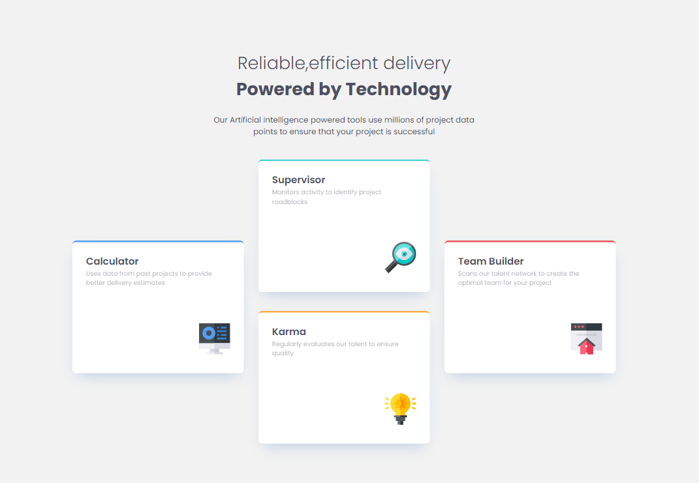

# Frontend Mentor - Four Card Solution

## Table of contents

- [Overview](#overview)
  - [Screenshot](#screenshot)
  - [Links](#links)
- [My process](#my-process)
  - [Built with](#built-with)
  - [What I learned](#what-i-learned)
  - [Continued development](#continued-development)
  - [Useful resources](#useful-resources)
- [Author](#author)
- [Acknowledgments](#acknowledgments)

## Overview

### Screenshot

### Links

- Solution URL: [https://github.com/qumelashvili/four-card]
- Live Site URL: [https://qumelashvili.github.io/four-card/]

## My process

### Built with

- Semantic HTML5 markup
- CSS custom properties
- Flexbox
- CSS Grid
- Mobile-first workflow
- JavaScript

Responsive with: @1440px @375px

## Author

Email - [zaozao03@gmail.com]
LinkedIn - [https://www.linkedin.com/in/zaur-q-a9a676136/]

